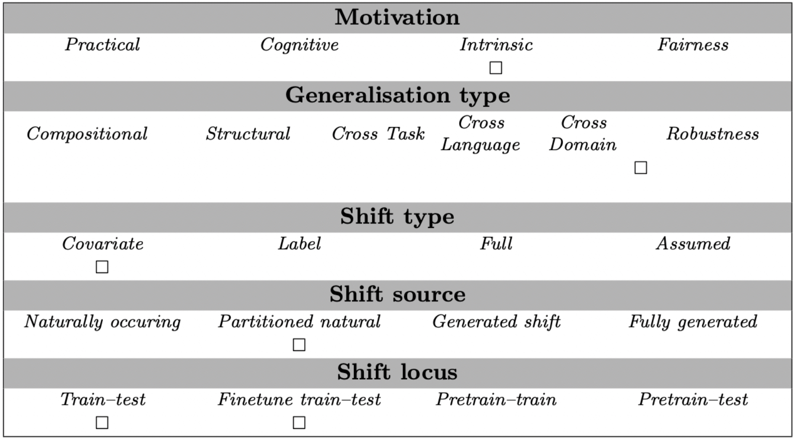

# Bias-amplified Splits (QQP)

## Abstract
NLP models often rely on superficial cues known as *dataset biases* to achieve impressive performance, and can fail on examples where these biases do not hold. 
Recent work sought to develop robust, unbiased models by filtering *biased* examples from training sets. In this work, we argue that such filtering can obscure the true capabilities of models to overcome biases, which might never be removed in full from the dataset. 
We suggest that in order to drive the development of models robust to subtle biases, dataset biases should be *amplified* in the training set. We introduce an evaluation framework defined by a *bias-amplified* training set and an *anti-biased* test set, both automatically extracted from existing datasets. 
Experiments across three notions of *bias*, four datasets and two models show that our framework is substantially more challenging for models than the original data splits, and even more challenging than hand-crafted challenge sets. 
Our evaluation framework can use any existing dataset, even those considered obsolete, to test model robustness. We hope our work will guide the development of robust models that do not rely on superficial biases and correlations. To this end, we publicly release our code and data.

## Examples
Quora Question Pairs (QQP) is a collection of question pairs from the community question-answering website Quora.
The task is to determine whether a pair of questions are semantically equivalent ("duplicate") or not ("not duplicate"). For instance:
```
question 1: How is air traffic controlled?
question 2: How do you become an air traffic controller?
label: not duplicate

premise: Where can I learn to invest in stocks?
hypothesis: How can I learn more about stocks?
label: duplicate
```

## Usage
This task can be used for regular finetuning. Afterwards, accuracy is used to score models' predictions.
Here is a small code snippet that illustrates how to load the dataset, and evaluate the accuracy of a single item:

```
from genbench import load_task
from genbench.api import PreparationStrategy

task = load_task("bias_amplified_splits:qqp")
ds = task.get_prepared_datasets(
    PreparationStrategy.FINETUNING, 
    shot_list=[0]
)
task.evaluate_predictions(
    predictions=[{"target": 1}],
    gold=[ds["test"][0]],
)
```

## Data Source
The data can be obtained from `glue/qqp` via the Huggingface dataset hub.
This data is subject to Quora's [Terms of Service](https://www.quora.com/about/tos), allowing for non-commercial use (see https://quoradata.quora.com/First-Quora-Dataset-Release-Question-Pairs).

## Limitations and Bias
TODO: *Note any known limitations or biases that the Bias-amplified Splits (QQP) has, with links and references if possible.*

## GenBench Eval card
- ***Generalisation type*** The generalisation type evaluated is 'robustness'.
- ***Motivation*** It is designed to better understand how models can overcome difficulties that are intrinsically hard for them, without further taking into account external factors of practicalities, fairness, etc.
- ***Shift source*** because all the data is natural, but the splitting dimension is unnatural, this is a partitioned, natural shift source.
- ***Shift locus*** This test can be used to evaluate a finetuned model (or a model trained from scratch)
- ***Shift type*** The shift type is a covariate one, considering that we do not modify the output distribution.


