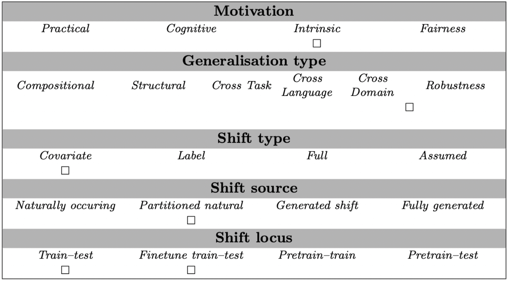

# Bias-amplified Splits (WANLI - Prompt-based)

## Abstract
NLP models often rely on superficial cues known as *dataset biases* to achieve impressive performance, and can fail on examples where these biases do not hold. 
Recent work sought to develop robust, unbiased models by filtering *biased* examples from training sets. In this work, we argue that such filtering can obscure the true capabilities of models to overcome biases, which might never be removed in full from the dataset. 
We suggest that in order to drive the development of models robust to subtle biases, dataset biases should be *amplified* in the training set. We introduce an evaluation framework defined by a *bias-amplified* training set and an *anti-biased* test set, both automatically extracted from existing datasets. 
Experiments across three notions of *bias*, four datasets and two models show that our framework is substantially more challenging for models than the original data splits, and even more challenging than hand-crafted challenge sets. 
Our evaluation framework can use any existing dataset, even those considered obsolete, to test model robustness. We hope our work will guide the development of robust models that do not rely on superficial biases and correlations. To this end, we publicly release our code and data.

## Examples
Given a premise sentence and a hypothesis sentence, the task is to predict whether the premise entails the hypothesis (entailment), contradicts the hypothesis (contradiction), or neither (neutral).  For instance:
```
Instruction: In this task, you are given a pair of sentences, sentence 1 and sentence 2. 
Your job is to determine if the two sentences clearly agree/disagree with each other, or if this cannot be determined. 
Indicate your answer as yes, no or maybe respectively.

Sentence 1: Your gift is appreciated by each and every student who will benefit from your generosity.
Sentence 2: The gift is appreciated by some students, but not those by who did not receive it.
label: yes

Sentence 1: Your gift is appreciated by each and every student who will benefit from your generosity.
Sentence 2: The generous offering is intendend to make the students' lives harder.
label: no

Sentence 1: Your gift is appreciated by each and every student who will benefit from your generosity.
Sentence 2: Hundreds of students will benefit from your generosity.
label: maybe
```

## Usage
This task can be used for prompt-based evaluation. Exact match is used to score models' predictions.
Here is a small code snippet that illustrates how to load the dataset, and evaluate performance on a single item:

```
from genbench import load_task
from genbench.api import PreparationStrategy

task = load_task("bias_amplified_splits:mnli_prompt_based")
ds = task.get_prepared_datasets(
    PreparationStrategy.PROMPT_BASED_TESTING, 
    shot_list=[2]
)
task.evaluate_predictions(
    predictions=[{"target": "no"}],
    gold=[ds[2][0]],
)
```

## Data Source
The data can be obtained from `alisawuffles/WANLI` via the Huggingface dataset hub.
MultiNLI is licensed under a Creative Commons Attribution 4.0 License (see https://huggingface.co/datasets/alisawuffles/WANLI).

## Limitations and Bias
TODO: *Note any known limitations or biases that the Bias-amplified Splits (WANLI) has, with links and references if possible.*

## GenBench Eval card
- ***Generalisation type*** The generalisation type evaluated is 'robustness'.
- ***Motivation*** It is designed to better understand how models can overcome difficulties that are intrinsically hard for them, without further taking into account external factors of practicalities, fairness, etc.
- ***Shift source*** because all the data is natural, but the splitting dimension is unnatural, this is a partitioned, natural shift source.
- ***Shift locus*** This test can be used to evaluate a finetuned model (or a model trained from scratch)
- ***Shift type*** The shift type is a covariate one, considering that we do not modify the output distribution.


