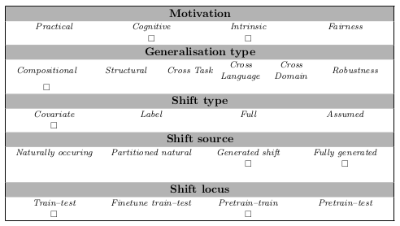

# BLM_tasks (agr_f_type_I_train)

## Abstract

BLM-AgrF is an instance of Blackbird's Language Matrices (BLM). This novel linguistic dataset is generatively constructed to support investigations in representation learning of grammatical rules. Each instance, consisting of a sequence of sentences and a candidate answer set, was built using a combination of rules, to provide a layered and structured dataset for learning more complex models. The various layers of the dataset allow for a variety of explorations, from disentangled sentence representations to capture structure and regularities within a sentence, to modular architectures that could capture structure and regularities in the sentence sequences. The purposefully built candidate answers supports  more in-depth analyses of the behaviour of a system, and provide insights into the source of prediction errors. 

The sentence structure is constructed to illustrate several underlying generative rules that describe different aspects of the linguistic phenomenon. These rules need to be identified and disentangled to correctly generalize and thus identify the correct answer. The sequence structure was designed in a similar manner to visual IQ tests, and follows a generative process of overlapping rules. The output is multiple choice. The correct sentence should be the correct continuation of the input sequence w.r.t. the dataset's generation rules.

## Examples
BLM-AgrF (agr_f_type_I_train) is a dataset capturing subject-verb agreement in French:

Input: 

|---|-----------|------------------|-----------------|--------|
| 1 | The vase  | with the flower  |                 | leaks. |
| 2 | The vases | with the flower  |                 | leak.  |
| 3 | The vase  | with the flowers |                 | leaks. |
| 4 | The vases | with the flowers |                 | leak.  |
| 5 | The vase  | with the flower  | from the garden | leaks. |
| 6 | The vases | with the flower  | from the garden | leak.  |
| 7 | The vase  | with the flowers | from the garden | leaks. |
| 8 | ???       |

Choices:

|                                                           |         |
|-----------------------------------------------------------|---------|
| The vase with the flower  and the garden  leaks.          | Coord   |
| extbf{The vases with the flowers  from the garden  leak.} | Correct |
| The vase with the flower   leaks.                         | WNA     |
| The vase with the flower   from the garden  leak.         | AE      |
| The vases with the flower  from the garden  leak.         | WN1     |
| The vases with the flowers  from the gardens  leak.       | WN2     |
|-----------------------------------------------------------|---------|

## Usage
The task is formatted as multiple choice. The input consists of a sequence of 7 sentences, separated by the end of sentence marker (</s>). The options are provided as a list of sentences, and the index of the correct one is specified as the target:

{
   "input": "Les soirées dans l'appartement ont gêné les résidents . </s> La soirée dans l'appartement a gêné les invités . </s> Les visites aux artistes approchent . </s> La menace de les attaquer inquiète les médecins . </s> Les visites au village des artisanats approchent . </s> La soirée dans l'appartement des propriétaires a gêné les voisins . </s> Les dangers de les réformes   dans les écoles inquiètent les médecins .", 
   "target": 5, 
   "target_options": ["L'avion pour le vol au-dessus des canyon s'écrase .", "L'avion pour les vols au-dessus des canyon s'écrasent .", "L'avion pour les vols au-dessus des canyon dans les réserves indiennes s'écrase .", "L'avion pour les vols et des canyon s'écrasent .", "Les instruments pour les vols au-dessus des canyon s'écrase .", "L'avion pour les vols au-dessus des canyon s'écrase ."]
}

## Data Source
The dataset was automatically generated based on manually selected seeds and predefined sentence templates. Compared to the 'agr_f' task, the training data for this subtask has minimal lexical variation both among the sentences in the input sequence, and between the input and output sentences.

## Limitations and Bias
The sentences and the sequence of sentences for each dataset have a prescribed structure. 

## GenBench Eval card

- *Generalisation type* The generalisation type evaluated is 'compositional' because the dataset is generated with overlapping (and compositional) rules, that a system should detect
- *Motivation* The motivation is both 'intrinsic' and 'cognitive': 'cognitive' because the dataset would test the capabilities of the system to detect the kind of information humans perceive in the provided data; 'intrinsic' because if a system can learn to detect specific linguistic information, we could adjust the model to detect different types of information.
- *Shift source* the data is automatically generated from manually collected seeds, and by applying prespecified (but naturalistic) templates.
- *Shift locus* is 'pretrained-trained' because we imagine a system would use representations of the data from a pretrained model to address the task of identifying specific linguistic phenomena.
- *Shift type* There is a difference in the lexical distribution in the training data and the test -- there is minimal variation in the lexical material in the training instances, whereas the test set has maximal lexical variation.

