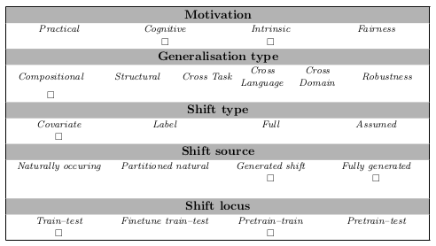

# BLM_tasks (alt_atl_type_I_train)

## Abstract
This dataset defines a BLM task for predicate-argument structure, with a structured dataset focused on the spray/load verb alternations in English. The input sequence for each problem instance consists of 7 sentences that include one alternant from the spray-load alternation and the target sentence is the other alternant, to be chosen among a minimally contrastive and adversarial set of answers. The dataset aims to facilitate investigations into how verb information is encoded in sentence embeddings and how well models can generalize the complex properties of argument structures.

The sentence structure is constructed to illustrate several underlying generative rules that describe different aspects of the linguistic phenomenon. These rules need to be identified and disentangled to correctly generalize and thus identify the correct answer. The sequence structure was designed in a similar manner to visual IQ tests, and follows a generative process of overlapping rules. The output is multiple choice. The correct sentence should be the correct continuation of the input sequence w.r.t. the dataset's generation rules.

## Examples
Input:

|   |                                                 |
|---|-------------------------------------------------|
| 1 | The girl sprayed the wall with paint.           |
| 2 | Paint was sprayed by the girl                   |
| 3 | Paint was sprayed onto the wall by the girl     |
| 4 | Paint was sprayed onto the wall                 |
| 5 | The wall was sprayed by the girl                |
| 6 | The wall was sprayed with the paint by the girl |
| 7 | The wall was sprayed with paint                 |
| 8 | ???                                             |

Choices:

|                                           |          |
|-------------------------------------------|----------|
| The girl sprayed paint onto the wall      | Correct  |
| The girl was sprayed paint onto the wall  | AgentAct |
| The girl sprayed paint the wall           | Alt1     |
| The girl sprayed with paint onto the wall | Alt2     |
| The girl sprayed paint for the room       | NoEmb    |
| The girl sprayed paint under the wall     | LexPrep  |
| Paint sprayed the girl onto the wall      | SSM      |
| The wall sprayed the girl with paint      | SSM      |
| Paint sprayed the wall with the girl      | AASSM    |

## Usage
The task is formatted as multiple choice. The input consists of a sequence of 7 sentences, separated by the end of sentence marker (</s>). The options are provided as a list of sentences, and the index of the correct one is specified as the target:

{
   "input": "The editors smudge the paper with grease. </s> Sarcasm was smudged by teachers. </s> The title was plastered on the vinyls by the band. </s> The pad was rubbed on the screen. </s> The box was loaded by the buyer. </s> The site was plastered with logos by the quartet. </s> The earth was seeded with carbon.", 
   "target": 4, 
   "target_options": ["Moses strung these lights under the fence.", "The author strews irony the book.", "Salt sprinkle the nuns over the beans.", "Teachers were smudged sarcasm on the canvas.", "He wraps it around his neck.", "Dirt spatters you whoever.", "The inside squirt you with a tiny bit of oil.", "Alex just sticks with the food in a box.", "Flanagan strews the humor of the movie."]
}

## Data Source
The dataset was automatically generated based on manually selected seeds and predefined sentence templates. The dataset contains a single verb alternation. Compared to the 'alt_atl' task, the training data for this subtask has minimal lexical variation both among the sentences in the input sequence, and between the input and output sentences.

## Limitations and Bias
The sentences and the sequence of sentences for each dataset have a prescribed structure. 

## GenBench Eval card

- *Generalisation type* The generalisation type evaluated is 'compositional' because the dataset is generated with overlapping (and compositional) rules, that a system should detect
- *Motivation* The motivation is both 'intrinsic' and 'cognitive': 'cognitive' because the dataset would test the capabilities of the system to detect the kind of information humans perceive in the provided data; 'intrinsic' because if a system can learn to detect specific linguistic information, we could adjust the model to detect different types of information.
- *Shift source* the data is automatically generated from manually collected seeds, and by applying prespecified (but naturalistic) templates.
- *Shift locus* is 'pretrained-trained' because we imagine a system would use representations of the data from a pretrained model to address the task of identifying specific linguistic phenomena.
- *Shift type* There is a difference in the lexical distribution in the training data and the test -- there is minimal variation in the lexical material in the training instances, whereas the test set has maximal lexical variation.

