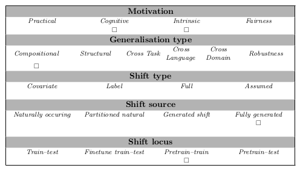

# BLM_tasks (atl_alt)

## Abstract
This dataset defines a BLM task for predicate-argument structure, with a structured dataset focused on the spray/load verb alternations in English. The input sequence for each problem instance consists of 7 sentences that include one alternant from the spray-load alternation and the target sentence is the other alternant, to be chosen among a minimally contrastive and adversarial set of answers. The dataset aims to facilitate investigations into how verb information is encoded in sentence embeddings and how well models can generalize the complex properties of argument structures.

The sentence structure is constructed to illustrate several underlying generative rules that describe different aspects of the linguistic phenomenon. These rules need to be identified and disentangled to correctly generalize and thus identify the correct answer. The sequence structure was designed in a similar manner to visual IQ tests, and follows a generative process of overlapping rules. The output is multiple choice. The correct sentence should be the correct continuation of the input sequence w.r.t. the dataset's generation rules.

## Examples

Input:

|:--:|:-----------------------------------------------|
| 1 | The girl sprayed the wall with paint.           |
| 2 | Paint was sprayed by the girl                   |
| 3 | Paint was sprayed onto the wall by the girl     |
| 4 | Paint was sprayed onto the wall                 |
| 5 | The wall was sprayed by the girl                |
| 6 | The wall was sprayed with the paint by the girl |
| 7 | The wall was sprayed with paint                 |
| 8 | ???                                             |

Choices:

|:------------------------------------------|:---------|
| The girl sprayed paint onto the wall      | Correct  |
| The girl was sprayed paint onto the wall  | AgentAct |
| The girl sprayed paint the wall           | Alt1     |
| The girl sprayed with paint onto the wall | Alt2     |
| The girl sprayed paint for the room       | NoEmb    |
| The girl sprayed paint under the wall     | LexPrep  |
| Paint sprayed the girl onto the wall      | SSM      |
| The wall sprayed the girl with paint      | SSM      |
| Paint sprayed the wall with the girl      | AASSM    |

## Usage
The task is formatted as multiple choice. The input consists of a sequence of 7 sentences, separated by the end of sentence marker (</s>). The options are provided as a list of sentences, and the index of the correct one is specified as the target:

{
   "input": "The buyer can load the tools in the box. </s> The crystals were scattered by the wizard. </s> The letters were hung on the ceiling by the artist. </s> Plenty of historical backstory was strewed in the figures. </s> Poles were sewed by them. </s> The sink was swashed with the chemicals by the volunteers. </s> The writing marks were rubbed with the eraser.", 
   "target": 2, 
   "target_options": ["The other place was sticked the center with the OEM drive.", "Whoever spatters the windshield the poison.", "I will hang the ceiling with the picture.", "The orb scatters earth under the dragons.", "Drizzle over the cream with brandy.", "Blotches of ink smudge them on the paper.", "The vegetables baste vinegar the farmers.", "The pot squirt the miners with the glue.", "The buyer can load the suitcase for the wedding."]}

## Data Source
The dataset was automatically generated based on manually selected seeds and predefined sentence templates. The dataset contains a single verb alternation.

## Limitations and Bias
The sentences and the sequence of sentences for each dataset have a prescribed structure. 

## GenBench Eval card

- *Generalisation type* The generalisation type evaluated is 'compositional' and 'structural', because the dataset is generated with overlapping (and compositional) rules, that a system should detect
- *Motivation* The motivation is both 'practical' and 'cognitive' because the dataset should test the capabilities of the system to reason in terms of rules as humans do, and as a side effect lead to more explainable models, which would have an impact on practicality
- *Shift source* the data is automatically generated from manually collected seeds, and by applying prespecified (but naturalistic) templates
- *Shift locus* This test can be used to evaluate a pretrained or finetuned model
- *Shift type* 

