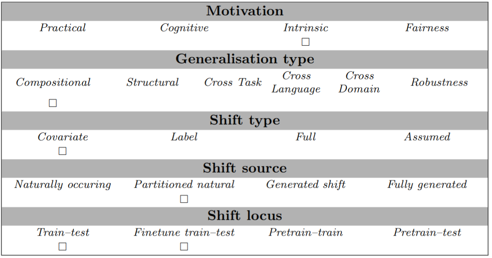

# Train-test data splits of the Europarl NMT corpus with divergent distributions of dependency relations
## Abstract
To assess NMT models' capacity to translate novel syntactical structures, we split the Europarl parallel corpus into training and testing sets with divergent distributions of the syntactical structures. We derive the data splitting method from the *distribution-based compositionality assessment* (DBCA) method introduced by Keysers et al. (2020). We define the *atoms* as the lemmas and dependency relations, and the *compounds* as the three-element tuples of two lemmas (the head and the dependant), and their relation, for instance `(appreciate, dobj, vigilance)`. 


## Examples
The task is simply sentence-level translation, e.g.:
```
"input": "If the House agrees, I shall do as Mr Evans has suggested.", "target": "Jos parlamentin jäsenet kannattavat sitä, teen niin kuin jäsen Evans ehdotti."
```


## Usage
To use the provided maximum-compound-divergence train-test split,
load the data, train a model on the training subset, and evaluate the model's predictions on the test subset
```
from genbench import load_task
from genbench.api import PreparationStrategy

# Load the task
task = load_task("dbca_deprel")
ds = task.get_prepared_datasets(PreparationStrategy.FINETUNING)

# Evaluate predictions
preds = ...
print(task.evaluate_predictions(
            predictions=preds,
            gold=ds['test'],
        )
    )
```

To compute the atom and compound divergences for any pair of training (pre-training, training and/or fine-tuning) and test data sets, use method `DbcaDeprelTask.divergence`. To create the atom and compound distributions of the training and test sets, the frequencies of each atom and compound in each set need to be first counted. The vectors that represent the atom and compound distributions of the train/test sets are inputted to the method to calculate the divergences:
```
# alpha is 0.5 for atom divergence and 0.1 for compound divergence
train_set_atom_distribution = np.array([2,4,10])
test_set_atom_distribution =  np.array([1,2,5])
atom_divergence = task.divergence(train_set_atom_distribution,
                                  test_set_atom_distribution,
                                  0.5)

train_set_compound_distribution = np.array([2,0,6])
test_set_compound_distribution = np.array([0,5,5])
compound_divergence = task.divergence(train_set_compound_distribution,
                                      test_set_compound_distribution,
                                      0.1)
```
Each element in the distribution vectors represents the frequency of one type of atom/compound.

To compare a model's capacity to generalise, we assess how much the translation accuracy decreases when the compound divergence between train and test sets increases. We keep atom distributions the same between train and test sets to make generalisation possible in principle. This means we should evaluate each model on both low- and high-compound-divergence data splits.

## Data Source
The original data source is `https://www.statmt.org/europarl/`

## Limitations and Bias
TODO

## GenBench Eval card

