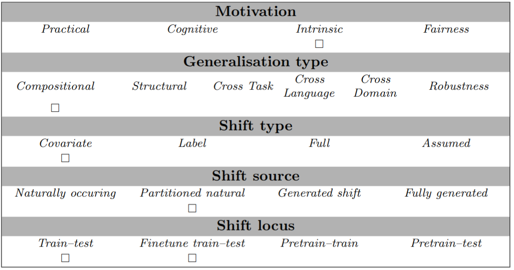

# Train-test data splits of the Europarl NMT corpus with divergent distributions of dependency relations
## Abstract
Compositional generalisation (CG), in NLP and in machine learning generally, has been assessed mostly using artificial datasets. It is important to develop benchmarks to assess CG also in real-world natural language tasks in order to understand the abilities and limitations of systems that are deployed in the wild. In our GenBench Collaborative Benchmarking Task submission, we utilise the distribution-based compositionality assessment (DBCA) framework to split the Europarl translation corpus into a training and test set in a way that translating the test set requires compositional generalisation capacity. Specifically, the training and test sets have divergent distributions of dependency relations, testing the NMT system's capacity to translate dependencies that they have not been trained on. 


## Examples
The task is simply sentence-level translation, e.g.:
```
"input": "If the House agrees, I shall do as Mr Evans has suggested.", "target": "Jos parlamentin jäsenet kannattavat sitä, teen niin kuin jäsen Evans ehdotti."
```


## Usage
To use the provided maximum-compound-divergence train-test split for a target language (German=de, French=fr, Greek=el, Finnish=fi), load the data, train a model on the training subset, and evaluate the model's predictions on the test subset
```
from genbench import load_task
from genbench.api import PreparationStrategy

# Load the task
task = load_task("europarl_dbca_splits")
ds = task.comdiv1_de.get_prepared_datasets(PreparationStrategy.FINETUNING)

# Evaluate predictions
preds = ...
print(task.comdiv1_de.evaluate_predictions(
            predictions=preds,
            gold=ds['test'],
        )
    )
```
To compare a model's capacity to generalise, we assess how much the translation accuracy decreases when the compound divergence between train and test sets increases. We keep atom distributions the same between train and test sets to make generalisation possible in principle. This means we should evaluate each model on both low- and high-compound-divergence data splits. To compute the generalisation score as described in the accompanying paper, train two systems on the splits with compound divergence values 0 and 1 (e.g. subtasks "comdiv0_de" and "comdiv1_de"), and take the ratio of the chrF2++ scores:  `task.comdiv1_de.evaluate_predictions(predictions_comdiv1_de, gold_comdiv1_de) / task.comdiv0_de.evaluate_predictions(predictions_comdiv0_de, gold_comdiv0_de)`

#### Using your other data sets:
To compute the atom and compound divergences for any pair of training (pre-training, training and/or fine-tuning) and test data sets, use method `EuroparlDbcaSplitsComdiv0De.divergence`. To create the atom and compound distributions of the training and test sets, the frequencies of each atom and compound in each set need to be first counted. The vectors that represent the atom and compound distributions of the train/test sets are inputted to the method to calculate the divergences:
```
import numpy as np
# alpha is 0.5 for atom divergence and 0.1 for compound divergence
train_set_atom_distribution = np.array([[2,4,10]])
test_set_atom_distribution =  np.array([[1,2,5]])
atom_divergence = task.comdiv1_de.divergence(train_set_atom_distribution,
                                  test_set_atom_distribution,
                                  0.5)
# atom_divergence = 0.0

train_set_compound_distribution = np.array([[2,0,6]])
test_set_compound_distribution = np.array([[0,5,5]])
compound_divergence = task.comdiv1_de.divergence(train_set_compound_distribution,
                                      test_set_compound_distribution,
                                      0.1)
# compound_divergence = 0.4793101280037947
```
Each element in the distribution vectors represents the frequency of one type of atom/compound.


## Data Source
The original data source is `https://opus.nlpl.eu/Europarl.php`

## Limitations and Bias
Our goal was to create a benchmark that tests generalisation to novel dependency relations in a comprehensive way, not selecting some specific types of dependency relations and leaving out other types. However, memory requirements of the data splitting algorithm did not permit us to use all of the atoms and compounds in the distribution divergence calculations, so we opted to leave out the most frequent and the most infrequent lemmas, and the dependency relations that include them, which probably affects the results.

## GenBench Eval card
The motivation is primarily intrinsic: it is important to assess if translation models learn the systematic rules that characterise natural language, in order to get some understanding how the models work. Another motivation is practical; compositional generalisation is important for the practical reason that it would make the models robust. The type of the generalisation is compositional, and the shift type is covariate, since the input data distribution changes but the task remains otherwise the same. Shift source is partitioned natural data, since we do not use any artificial data, but the train-test split is artificial. Lastly, the shift locus in our experiments is train-test, but the method and benchmark could also possibly be used as a finetune train-test benchmark, by finetuning a pretrained model on the training set.


