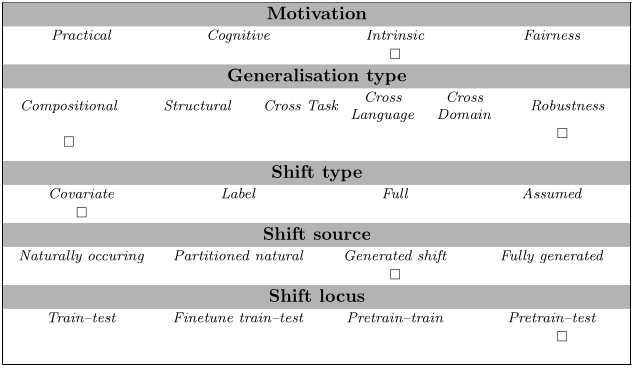

# Frequency based mathematics -- an example task

This is an example task for measuring generalisation in LLMs, given the frequency
of terms in their pretraining corpus. It quantifies memorisation in a simple 
multiplication task, by computing the extent to which the accuracy of a model
depends on the frequency of the terms in the pretraining corpus. In particular,
it defines generalisation as `1 - abs(cor(accuracy, pretraining_term_frequencies)`.
We estimate the accuracy for a particular term by multiplying it with 20 other
terms, and computing the average score. 
This measure is inspired by the work of [Razehgi et al (2022)](https://aclanthology.org/2022.findings-emnlp.59/),
who measure the correlation between the pretraining term frequencies and a models performance.

*NB* This task serves illustrative purposes and is meant to provide inspiration. The measure has
not been tested on real data, and there are no empirical results (yet?) that prove that this
measure is useful in practice.

## Abstract
Because this is an example task, there is no paper abstract.

## Examples

The samples in this task are simple arithmetics problems, e.g.:

```
What is ten times 31?
```

## Usage

This task requires the user to compute the unigram frequencies of the numbers ten to fifty (spelled out).
Those terms should be provided in a dictionary, with as keys the terms (e.g. `twenty`) and as value the 
(potentially normalised) frequency in the pretraining corpus.

```
# Load the task
task = load_task("frequency_based_mathematics")
ds = task.get_prepared_datasets(
    PreparationStrategy.PROMPT_BASED_TESTING,
    shot_list=[0])[0]

# Load your pretraining frequencies and model predictions 
pretraining_freqs = ...
preds = ...

for pred_type, preds in preds.items():
    for freq_type, pretraining_freq in pretraining_freqs.items():
        scores = task.evaluate_predictions(
            predictions=preds,
            gold=ds,
            term_freqs=pretraining_freq
        )

print(f'Scores: {scores}')
```

## Data Source
The (dummy) test data is hosted at [https://github.com/dieuwkehupkes/genbench_cbt_sample_submission/blob/template/src/genbench/tasks/frequency_based_mathematics/test_data.jsonl], under an Apache 2.0 license.

## Limitations and Bias
This is an example task for illustrative purposes, it has not been tested empirically.

## GenBench eval card
This test can be used to test generalisation in LLMs (pretrain - test locus).
It is designed to better understand how LLMs generalise (intrinsic motivation), and can be used to assess 
compositional generalisation or -- more generally -- robustness.
Because the test (input) samples differ in their frequency distribution wrt the training corpus, 
we assume that the shift is a covariate shift.


