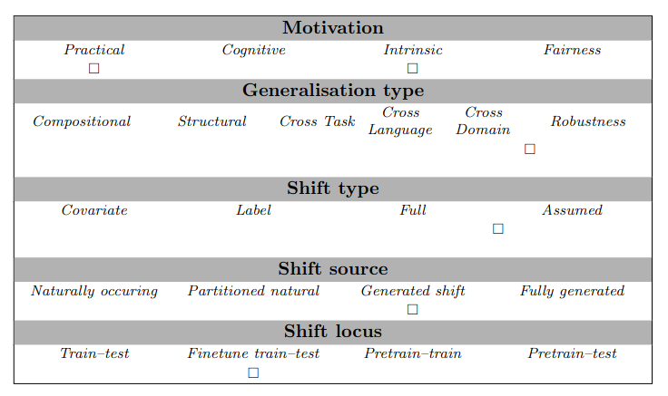

# Hate Speech Detection

## Abstract
This project aims to go beyond the random train-test split by developing a more challenging data-splitting process 
to better evaluate generalisation performance.
We rely on a models internal representations to create a data split specifically designed for a provided model. 
We create the split by clustering the internal representations and assigning clusters to either the train or the test set.
Hate Speech is used as a testing ground for developing the splitting method.

## Examples
{"input": "wow i guess soyboys are the same in every country", "target": "noHate", "target_options": ["hate", "noHate"]}
{"input": "A subsection of retarded Hungarians? Ohh boy. brace for a livid Bulbasaur coming in here trying to hate a hole in some of her stupider countrymen.", "target": "hate", "target_options": ["hate", "noHate"]}

## Usage
For the task, the model has to decide whether a social media post includes hate speech or not.

## Data Source
The dataset was published in `A Benchmark Dataset for Learning to Intervene in Online Hate Speech` by Jing Qian, Anna Bethke, Yinyin Liu, Elizabeth Belding, William Yang Wang in 2019.
The dataset is licensed under the Creative Commons Attribution-NonCommercial 4.0 International Public License. To view a copy of this license, visit https://creativecommons.org/licenses/by-nc/4.0/ or send a letter to Creative Commons, PO Box 1866, Mountain View, CA 94042, USA.

## Limitations and Bias
*Note any known limitations or biases that the Hate Speech Detection has, with links and references if possible.*

## GenBench Eval card
This method can be used to test generalisation in HateSpeech for LLMs (pretrain - test locus).
The split is based on the feature representations of a language model, therefore we assume that the shift is a covariate 
shift. The method assesses the robustness of language models and how well they generalise.

