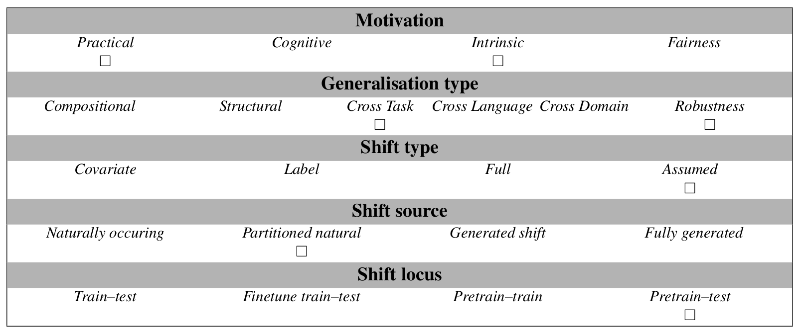

# ICL consistency test

The ICL consistency test measures the consistency of LLM predictions on the same datapoints across many different setups.
Different setups are defined by "factors". On the one hand, factors can be specific attributes of the used prompt (e.g. 
the number of examples the model is presented with ["n_shots"] or the type of instructions that were used to wrap a 
specific datapoint ["Instructions"]). On the otherhand, the analysis can also be augmented by factors that are related 
to the way a model is evaluated (e.g. whether a model is calibrated) or the type of model that is evaluated (e.g. the 
number of parameters or instructions tuning). These external factors can be added into analysis by using the 
task.add_factor() method. The output-metric is Cohen\'s kappa for each factor across all different conditions. 
A kappa-value close to 1 indicates that the factors does not change the model prediction, while a factor close to 0 
strongly changes model predictions. Currently, this test evaluats the ANLI-dataset (Nie et al., 2019).

*Size*: for 600 data_IDs. The user can choose to reduce the number of evaluated data_IDs.

## Abstract
Finding the best way of adapting pre-trained language models to a task is a big challenge in current NLP.
Just like the previous generation of task-tuned models (TT), models that are adapted to tasks via in-context-learning (ICL) or instruction tuning (IT) are robust in some setups, but not in others.
Here, we present a detailed analysis of which design choices cause instabilities and inconsistencies in LLM predictions.
First, we show how spurious correlations between input distributions and labels -- a known issue in TT  models -- form only a minor problem for prompted models.
Then we engage in a systematic, holistic evaluation of different factors that have been found to influence predictions in a prompting setup.
We test all possible combinations of a range of factors on both vanilla and instruction-tuned LLMs of different scale, and statistically analyse the results to show which factors are the most influential, the most interactive or the most stable.
From our results, we deduce which factors can be used without precautions, should be avoided or handled with care in most settings.

## Examples
The test evaluates the same datapoints across many different setups to determine the consistency of a model's predictions. Every datapoint has a data_ID (specifying the original datapoint) and a setup_ID (with each digit specifying the presence or absence of a factor).

Example with data_ID - 1120; setup_ID - id0_0200020:
```
The city's name derives from the Greek words "άργυρος" ("árgyros" meaning 
"silver") and "πόλη" ("poli" meaning "city"). The name's older form was 
"Argyroupolis". The first name of the settlement was "New Argyroupolis", 
given by the refugees from Gümüşhane. Using only the above description 
and what you know about the world, "The city's name derives from Greek words." 
is definitely correct, incorrect, or inconclusive? 

ANSWER:  Correct.

Undead is a 2003 Australian zombie science fiction horror comedy film 
written and directed by Michael and Peter Spierig and starring Felicity 
Mason, Mungo McKay and Rob Jenkins. It was then-relatively-unknown "Good Game" 
presenter Steven O'Donnell's first film role. Using only the above description 
and what you know about the world, "Steven O'Donnell was not a popular actor before 
the 2003 Zombie movie." is definitely correct, incorrect, or inconclusive? 

ANSWER:  Correct.

Let the Music Do the Talking is the first of four albums by The Joe Perry 
Project. It was their the most successful, selling approximately 250,000 
copies in the United States. The title track was re-recorded by Joe Perry's 
more successful band Aerosmith on their album "Done With Mirrors", albeit 
with a slightly different melody and Steven Tyler penned lyrics. Using only 
the above description and what you know about the world, ""Done With Mirrors"
was an album by The Joe Perry Project." is definitely correct, incorrect, or 
inconclusive? 

ANSWER: 
```
_Added line breaks for readability_
## Usage
For an example script copy `example_evaluation.py` into your genbench root directory (`<path-to-genbench>/genbench_cbt`) and run it.
#### Dataloading
The task can loaded through the default GenBench interface as a zero-shot task:
```python
from genbench import load_task
from genbench.api import PreparationStrategy

task = load_task("icl_consistency_test")
ds = task.get_prepared_datasets(
                    PreparationStrategy.PROMPT_BASED_TESTING, 
                    shot_list=[0]
                    )[0]
```
#### Evaluation
Provide the evaluation function with the model outputs as strings, accompanied by the corresponding setup-ids and data-ids 
from the original dataset.
For the predictions, please follow the following format: 

`predictions: Dict[setup_ID, Dict[data_ID, model_output]]`

For the gold labels, please provide the original dataset ds:

`gold: datasets.Dataset`

With this input, run the task evaluation like so:
```python
results = task.evaluate_predictions(predictions=predictions, 
                                    gold=ds)
```

#### Adding factors
External factors can be added via the `task.add_factor()` method.
```python
predictions = (predictions_factor_absent, predictions_factor_present)
predictions = task.add_factor(data=predictions, 
                              factor='<name_of_additional_factor>')
```
where `predictions_factor_absent` and `predictions_factor_present` are dictionaries of the same format as the original 
predictions dictionary.

#### Removing factors
Factors can be removed from the dataset and the evaluation by using the `task.remove_factor()` method.
```python
predictions = task.remove_factor(data=ds, 
                                 factor='<name_of_factor_to_be_removed>')
```
where `ds` is the original dataset as obtained by the `task.get_prepared_datasets()` method. Note that removing factors 
will influence the results on all other factors.

## Data Source
The original data stems from the ANLI dataset (Nie et al., 2019).
Prompting templates are taken from promptsource (Bach et al., 2022).

## Limitations and Bias
We identify the following limitations of the consistency test:
1. The number of factors in limited and does not cover all possible factors that might influence the predictions. We limited ourselves to factors we deem relevant, to ensure fast evaluation.

2. Currently, the test is only implemented for the ANLI-dataset.

3. External factors such as _Instruction tuning_ or _calibration_ have to be manually added by the user using the `task.add_factor()` method. 


## GenBench Eval card
This test can be used to test generalisation in LLMs (pretrain - test locus).
It is designed to better understand how LLMs generalise (intrinsic motivation) and to give practical hints on relevant prompt-design decisions (practical motivation). It can be used to assess robustness.




## References

Nie, Y., Williams, A., Dinan, E., Bansal, M., Weston, J., & Kiela, D. (2019). Adversarial NLI: A new benchmark for natural language understanding. arXiv preprint arXiv:1910.14599.

Bach, S. H., Sanh, V., Yong, Z. X., Webson, A., Raffel, C., Nayak, N. V., ... & Rush, A. M. (2022). Promptsource: An integrated development environment and repository for natural language prompts. arXiv preprint arXiv:2202.01279.

