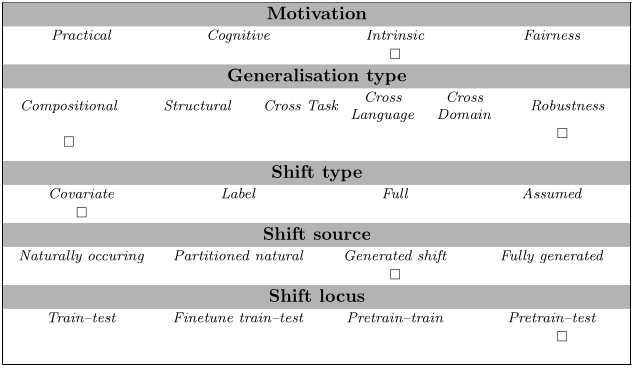

# Quantifier Understanding

The task evaluates generalization in the understanding of quantifiers. It aims to measure
how well can language models capture the semantics of logical quantifiers in natural language. It tests compositional and robustness generalisation.


## Examples

Given a question about a quantifier, determine if the answer is true or false.

```
There are 10 tables. 7 of the tables are blue. 3 of the tables are red. Are less than half of the tables red? Answer with only one word, true or false.
```

## Data Source

The test data is fully generated using rule-based methods.

The data is hosted here [https://github.com/lerow/genbench_cbt/blob/quantifier_understanding/src/genbench/tasks/quantifier_understanding/test_data.jsonl].


## GenBench eval card


