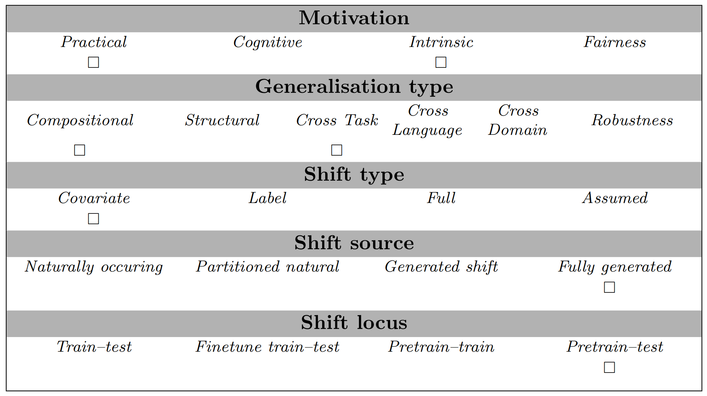

# Reasoning about Ambiguous Definite Descriptions

## Abstract
Natural language reasoning plays an increasingly important role in improving language models' ability to solve complex 
language understanding tasks. An interesting use case for reasoning is the resolution of context-dependent ambiguity.
But no resources exist to evaluate how well Large Language Models can use explicit reasoning to resolve ambiguity in 
language. We propose to use ambiguous definite descriptions for this purpose and create and publish the first benchmark
dataset consisting of such phrases. Our method includes all information required to resolve the ambiguity in the prompt,
which means a model does not require anything but reasoning to do well.

## Example
|          | Component           | Explanation                                                                                                                  | Example                                                                                                                                                                         |
|----------|---------------------|------------------------------------------------------------------------------------------------------------------------------|---------------------------------------------------------------------------------------------------------------------------------------------------------------------------------|
| Premises | entity-relations    | A number of relations of the entity and the context in which it is true.                                                     | Lars Lervik was part of the Telemark Battalion from January 2010 to January 2013.    Lars Lervik was part of the Brigade Nord from January 2018 to January 2020.            | 
|          | relation-properties | The value of the property for each relation.                                                                                 | Brigade Nord is a military unit of size class brigade.    Telemark Battalion is a military unit of size class battalion.                                                    |
|          | regularity          | The relevant rule or regularity that is required to resolve the ambiguity.                                                   | Military units do not change size class.                                                                                                                                        |
| Question | context             | Establishes the current context.                                                                                             | If the current date is June 2019                                                                                                                                                |
|          | sentence            | An ambiguous sentence with a temporal operator and a property being ascribed to an entity denoted by a definite description. | what is the most likely interpretation of the following sentence:   The military unit of Lars Lervik was of size class brigade in March 2010.                               |
|          | interpretations     | Two interpretations for the ambiguous sentence, one of which contradicts the regularity.                                     | 1. Lars Lervik's unit in March 2010 (Telemark Battalion) was of size class brigade.   2. Lars Lervik's current unit (Brigade Nord) was of size class brigade in March 2010. |

## Usage
*Describe how to load your task and what is required for evaluation, if anything.*

## Data Source
We create a (semi-)automatically generated dataset based on Wikidata.
This dataset is based on 5 Wikidata property-pairs, and is in English. 
We focus on creating ambiguous sentences with a temporal operator.
Wikidata contains many triples qualified with the [P580](https://www.wikidata.org/wiki/Property:P580) and 
[P582](https://www.wikidata.org/wiki/Property:P582) properties to indicate the period in which they were true.

For a given main entity (e.g., Lars Lervik) we find the relations corresponding to that entity (Lars Lervik's military 
units and the beginning and end of his term with them). This information is combined with a property of the relations 
that does not change over time (the size class of the military units). Pairs of these relations are sampled such that 
the property (the size class) has different values for the two relations (in this case, one brigade and one battalion).
Note that by changing property we ascribe to the denotee we can flip which of the interpretations is correct 
(*battalion* instead of *brigade*) so we can generate two mirror instances for each entity and relation-pair.

## Limitations and Bias
The *de dicto* / *de re* ambiguity we use in our dataset is one of many possible kinds of ambiguities. 
Completely excluding the possibility that our results rely on the particulars of this ambiguity will require a diverse 
set of ambiguities.

So far we have only included English prompts in our benchmark.
We leave the creation of prompt templates in other languages for future work.

## GenBench Eval card
This task is intended to test if LLMs (Pretrain-test locus) are capable of resolving ambiguous phrases by reasoning 
about them (primarily intrinsic motivation, but also practical). This task consists of choosing between two possible 
interpretations of an ambiguous sentence (compositional generalisation), and the model is required to resolve it through
natural language reasoning (cross task generalisation). Our data is fully generated and focuses on a very particular 
kind of language use ensuring Covariate shift, we might also have a label shift, but we do not know if our label 
distribution (50/50) differs from the training setting.

