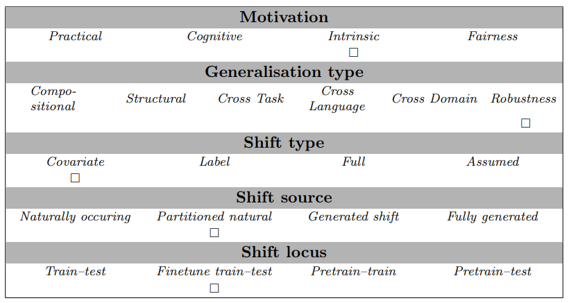

# Training dynamics split for WiC (example task)

When training a model on a dataset, that reveals a lot about the difficulty of examples.
In this split, we trained Roberta-base models on the WiC dataset (combined train and validation),
and measured the mean likelihood of the targets over the course of training.
That confidence metric is used to create a new, and extra challenging train-test split.

```
Pilehvar, M. T., & Camacho-Collados, J. (2019). WiC: the Word-in-Context Dataset for Evaluating Context-Sensitive Meaning Representations. In Proceedings of NAACL-HLT (pp. 1267-1273).
```

## Abstract
Because this is an example task, there is no paper abstract.

## Examples
The samples in this task require indicating whether the same sense of one word is being used in two different contexts, for instance:
```
bed </s> There's a lot of trash on the bed of the river </s> I keep a glass of water next to my bed when I sleep
```

## Usage

This task can be used for regular finetuning. Afterwards, accuracy is used to score models' predictions.
Here is a small code snippet that illustrates how to load the dataset, and evaluate the accuracy of a single item:

```
from genbench import load_task
from genbench.api import PreparationStrategy

task = load_task("traindyn_wic")
ds = task.get_prepared_datasets(
    PreparationStrategy.FINETUNING, 
    shot_list=[0]
)
task.evaluate_predictions(
    predictions=[{"target": 1}],
    gold=[ds["test"][0]],
)
```

## Data Source
The data can be obtained from `super_glue/wic` via the Huggingface dataset hub.
WiC is licensed under a Creative Commons Attribution-NonCommercial 4.0 License (see https://pilehvar.github.io/wic).

## Limitations and Bias
This is an example task for illustrative purposes, it has not been tested empirically.

## GenBench eval card
- *Shift locus* This test can be used to evaluate a finetuned model (or a model trained from scratch): pretrain-test locus.
- *Motivation* It is designed to better understand how models can overcome difficulties that are intrinsically hard for them, without further taking into account external factors of practicalities, fairness, etc.
- *Shift type* The shift type is a covariate one, considering that we do not modify the output distribution.
- *Generalisation type* The generalisation type evaluated is 'robustness',
- *Shift source* and because all the data is natural, but the splitting dimension is unnatural, this is a partitioned, natural shift source.


